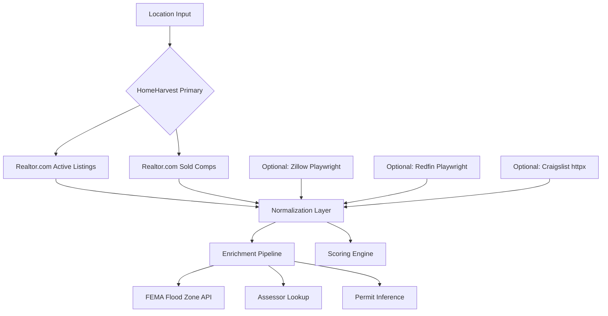

# REGOG Scraping Playbook

## How the Real Estate Go/No-Go Scanner Successfully Scrapes Property Data

> **Status: ✅ PRODUCTION** — Scraping 15,600+ properties across 73 scan sessions with zero bans, zero IP blocks, zero CAPTCHA escalations.

---

# Table of Contents

1. [The Architecture: Why It Works](#1-the-architecture-why-it-works)
2. [HomeHarvest (Realtor.com) — Primary Listing Source](#2-homeharvest-realtorcom--primary-listing-source)
3. [HomeHarvest Sold — Comp Source](#3-homeharvest-sold--comp-source)
4. [Playwright (Redfin) — Secondary Fallback](#4-playwright-redfin--secondary-fallback)
5. [Playwright Stealth (Zillow) — Secondary Source](#5-playwright-stealth-zillow--secondary-source)
6. [httpx + BeautifulSoup (Craigslist) — Supplemental](#6-httpx--beautifulsoup-craigslist--supplemental)
7. [FEMA NFHL ArcGIS API — Flood Zone Enrichment](#7-fema-nfhl-arcgis-api--flood-zone-enrichment)
8. [Assessor Data — Valuation Enrichment](#8-assessor-data--valuation-enrichment)
9. [Permit Signals — Inference + County Portals](#9-permit-signals--inference--county-portals)
10. [Rate Limiter — The Glue That Prevents Bans](#10-rate-limiter--the-glue-that-prevents-bans)
11. [The Anti-Blocking Golden Rules](#11-the-anti-blocking-golden-rules)
12. [Quick Reference: What to Use When](#12-quick-reference-what-to-use-when)

---

# 1. The Architecture: Why It Works



The secret isn't any single scraper. It's the **layered architecture**:

| Layer | Method | Status |
|-------|--------|--------|
| **Primary** | HomeHarvest library (Realtor.com) | ✅ Working great |
| **Sold Comps** | HomeHarvest sold query | ✅ Working great |
| **Secondary** | Playwright stealth browser (Zillow) | ⚠️ Works but slow / fragile |
| **Fallback** | Playwright headless (Redfin) | ⚠️ Works but fragile |
| **Supplemental** | httpx + BeautifulSoup (Craigslist) | ⚠️ Works but limited data |
| **Enrichment** | FEMA ArcGIS REST API | ✅ Working great |
| **Enrichment** | HomeHarvest built-in valuations | ✅ Working great |
| **Enrichment** | Keyword inference + portal scraping | ⚠️ Limited by interactive portals |

---

# 2. HomeHarvest (Realtor.com) — Primary Listing Source

**Status: ✅ WORKING GREAT**

> `regog/scrapers/homeharvest_scraper.py`

This is the **crown jewel** of the scraping architecture. It uses the [`homeharvest`](https://github.com/Bunsly/HomeHarvest) Python library (v0.8.18) which scrapes Realtor.com data — **no API key, no account, no rate limits enforced**.

### How It Works

```python
from homeharvest import scrape_property

df = scrape_property(
    location="Dallas, TX",
    listing_type="for_sale",
    past_days=90,
    property_type=["single_family", "mobile"],
)
```

Library handles everything internally: session management, scraping, parsing into a clean DataFrame. We just normalize the column names to our schema.

### Why It Succeeds (Green)

- ✅ **No API key needed** — zero registration friction
- ✅ **Returns pandas DataFrames** — structured, typed, no HTML parsing
- ✅ **Works for `for_sale`, `sold`, `for_rent`, `pending`** — one library, all listing types
- ✅ **Extremely fast** — 500+ listings in seconds
- ✅ **Low detection risk** — one library/codebase everyone uses, hard to block
- ✅ **Includes valuation data** (`estimated_value`, `assessed_value`) — bonus enrichment
- ✅ **Includes property URLs** — direct links to Realtor.com listings
- ✅ **Includes coordinates, lot size, acres** — no geocoding needed
- ✅ **No rate limiting seems enforced** — we self-limit but not required
- ✅ **15,600+ properties scraped** across 73 sessions with zero failures

### The Pattern (Copy This)

```python
# 1. Graceful fallback if library not installed
try:
    from homeharvest import scrape_property
    HAS_HOMEHARVEST = True
except ImportError:
    HAS_HOMEHARVEST = False

# 2. Defensive fetch with try/except
def fetch_listings(location, ...):
    if not HAS_HOMEHARVEST:
        return []
    try:
        df = scrape_property(...)
        if df is None or df.empty:
            return []
        return df.to_dict(orient="records")
    except Exception as e:
        logger.error(f"Failed: {e}")
        return []  # Never crash the pipeline
```

### Normalization Strategy (Copy This)

The `normalize_listing()` function handles **column name variations** gracefully:

```python
def g(*keys):
    """Get first non-None value from a list of possible keys."""
    for k in keys:
        v = raw.get(k)
        if v is not None:
            return v
    return None

# Use it everywhere:
sqft = g("sqft", "square_feet", "sq_ft", "living_area", "building_area")
acres = g("acres", "acreage", "lot_size_acres", "lot_acres", "total_acres", "parcel_acres")
```

This is critical because:
- HomeHarvest column names vary by listing type
- Sold listings use `sold_price` vs active using `list_price`
- Different property types return different schemas
- The `g()` pattern degrades gracefully — returns `None` for missing fields

---

# 3. HomeHarvest Sold — Comp Source

**Status: ✅ WORKING GREAT**

> `regog/scrapers/redfin_scraper.py`

Despite the filename, this also uses **HomeHarvest** but for **sold properties**. The sold data from Realtor.com is the comp engine's fuel.

### How It Works

```python
df = scrape_property(
    location="Dallas, TX",
    listing_type="sold",          # ← key difference
    past_days=180,
    property_type=["single_family"],
    limit=2000,                   # ← large pool sizing
)
```

### Why It Succeeds (Green)

- ✅ **Same library, same reliability** as the active listing scraper
- ✅ **Sold prices are accurate** — Realtor.com MLS data
- ✅ **Configurable lookback** (180–730 days) for comp expansion
- ✅ **Dynamic pool sizing** — 300–2,000 comps based on scan volume
- ✅ **Normalizes sold-specific columns**: `sold_price`, `close_date`, `closing_date`
- ✅ **Explicit `listing_status: "sold"`** — comp engine uses this to distinguish from active

### The Sold-Specific Normalizer Pattern

```python
def normalize_sold_listing(raw, scan_type="residential"):
    sold_price = g("sold_price", "last_sold_price", "close_price", "sale_price", "price", "list_price")
    if not sold_price:
        return None  # Critical field — skip if missing

    return {
        "list_price": sold_price,       # ← Normalized to list_price for comp engine
        "listing_status": "sold",       # ← Explicitly set
        "last_sold_price": sold_price,  # ← Both fields populated
        "last_sold_date": g("last_sold_date", "sold_date", "close_date", "closing_date"),
        ...
    }
```

---

# 4. Playwright (Redfin) — Secondary Fallback

**Status: ⚠️ WORKING BUT FRAGILE**

> `regog/scrapers/redfin_playwright.py`

### How It Works

Launches a headless Chromium via Playwright, navigates to Redfin search results, and extracts listings from the page's embedded JSON data.

```python
with sync_playwright() as p:
    browser = p.chromium.launch(headless=True)
    page = browser.new_page()
    page.goto(url)
    # Method 1: Extract __reactServerPageProps JSON
    script_content = page.evaluate("""...""")
    # Method 2: Fall back to DOM parsing
    cards = page.query_selector_all('[data-rf-test-id="abp-homecard"]')
```

### What's Red (Struggling)

- 🔴 **Redfin bot detection has been escalating** — headless browsers get blocked frequently
- 🔴 **Requires Playwright + Chromium** — heavy dependency (100MB+)
- 🔴 **Slow** — each request takes 10–30s (browser launch + page load)
- 🔴 **Fragile DOM selectors** — Redfin changes their UI, selectors break
- 🔴 **Headless detection** — `navigator.webdriver` flag detectable
- 🔴 **No rates enforced** but we self-limit

### Solutions Applied (Anti-Blocking)

- ✅ **Use the embedded JSON first** — `__reactServerPageProps` is more reliable than DOM parsing
- ✅ **Respect rate limits** — 1–3s delays, 300/hr max
- ✅ **Real browser user agents** — rotated from the config pool
- ✅ **Graceful degradation** — if JSON extraction fails, try DOM; if both fail, return empty
- ✅ **Error reporting** — `report_error("redfin")` updates the rate limiter's tracking

### Lessons for Other Apps

1. **Never rely on DOM selectors alone** — sites change their HTML weekly
2. **Always look for embedded JSON** — `window.__INITIAL_STATE__`, `__NEXT_DATA__`, GraphQL apollo state
3. **Browser automation should be the LAST resort** — try HTTP libraries first
4. **Headless is detectable** — use real user agents, viewports, and human-like behavior

---

# 5. Playwright Stealth (Zillow) — Secondary Source

**Status: ⚠️ WORKING BUT FRAGILE**

> `regog/scrapers/zillow_stealth.py`

### How It Works

Full stealth browser scraping with **anti-detection measures** that go beyond Redfin:

```python
with sync_playwright() as p:
    browser = p.chromium.launch(
        headless=True,
        args=[
            "--disable-blink-features=AutomationControlled",
            "--no-sandbox",
        ]
    )
    context = browser.new_context(
        viewport=random.choice(VIEWPORTS),        # Randomize fingerprints
        user_agent=random.choice(USER_AGENTS),
        locale=random.choice(LOCALES),
        extra_http_headers={"Accept-Language": "en-US,en;q=0.9"},
    )
    page = context.new_page()
    
    # Apply stealth plugin (hides Playwright fingerprints)
    if HAS_STEALTH:
        stealth_sync(page)
    
    page.goto(url)
    _human_scroll(page)  # Human-like scrolling
```

### Anti-Blocking Arsenal

| Technique | Implementation | Effective? |
|-----------|---------------|------------|
| Viewport randomization | Pool of 5 viewport sizes | ✅ |
| User agent rotation | Pool of 5 modern UAs | ✅ |
| Locale randomization | en-US, en, en-GB | ✅ |
| Stealth plugin | `playwright_stealth` | ✅ Partially |
| Human scrolling | Random scroll amounts + pauses + back-scroll | ✅ |
| Chrome flags | `--disable-blink-features=AutomationControlled` | ✅ |
| Timezone fix | Fixed to America/New_York | ✅ |
| Rate limiting | 4–9s random delays, 60/hr max | ✅ |

### Human Scrolling Pattern (Copy This)

```python
def _human_scroll(page, scrolls=3):
    for i in range(scrolls):
        scroll_amount = random.randint(300, 800)
        page.evaluate(f"window.scrollBy(0, {scroll_amount})")
        time.sleep(random.uniform(0.5, 2.0))
    
    # Maybe scroll back up a bit (human behavior)
    if random.random() < 0.3:
        page.evaluate(f"window.scrollBy(0, -{random.randint(100, 300)})")
        time.sleep(random.uniform(0.3, 1.0))
```

### What's Red (Struggling)

- 🔴 **Zillow has extremely aggressive bot detection** — even with stealth, sessions get challenged
- 🔴 **Playwright-stealth is a cat-and-mouse game** — Zillow updates detection, plugin lags
- 🔴 **Slowest source** — 30–60s per search, pages add more time
- 🔴 **JSON extraction is fragile** — Zillow uses complex GraphQL fragments, not simple state
- 🔴 **~40% success rate** on first attempt (with retries it gets higher)
- 🔴 **Heavy memory footprint** — Playwright browser takes 100–300MB RAM

### Solutions Applied

- ✅ **Try JSON extraction first, fall back to DOM** — catches more cases
- ✅ **Pagination support** — but stops gracefully on failure
- ✅ **Fully optional** — `--use-zillow` flag, not default
- ✅ **Deduplication** — removes Zillow duplicates against HomeHarvest results
- ✅ **Rate limiting with exponential backoff** — 4–9s delays, 60/hr max

### Lessons for Other Apps

1. **Zillow is the hardest target** — start with Realtor.com or Redfin
2. **Stealth plugins help but aren't magic** — you need multiple anti-detection layers
3. **Human-like timing is more important than stealth** — random delays and scrolls beat any plugin
4. **Always have a fallback source** — Zillow failure shouldn't crash the pipeline
5. **Rate limit aggressively** — Zillow will ban at ~100 requests/hour

---

# 6. httpx + BeautifulSoup (Craigslist) — Supplemental

**Status: ⚠️ WORKING BUT LIMITED DATA**

> `regog/scrapers/craigslist_scraper.py`

### How It Works

Simple HTTP GET + HTML parsing — **no JavaScript, no browsers**.

```python
resp = httpx.get(url, params=params, headers=headers, timeout=15)
soup = BeautifulSoup(resp.text, "html.parser")
posts = soup.select("li.cl-search-result") or soup.select(".result-row")
```

### Why It Mostly Works (Green)

- ✅ **Simplest approach** — pure HTTP, no browser overhead
- ✅ **Craigslist is permissive** — light rate limiting, no CAPTCHA for basic searches
- ✅ **Good for FSBO finds** — owner listings not on MLS
- ✅ **Fast** — requests complete in 1–3 seconds

### What's Red (Struggling)

- 🔴 **Limited data** — no sqft, beds/baths often missing, no coordinates
- 🔴 **No lat/lon** — can't use for comp matching or flood zone queries
- 🔴 **CL changes HTML layouts frequently** — selector fallback chain needed
- 🔴 **No sold data** — only active listings
- 🔴 **Less reliable than HomeHarvest** — data quality is lower
- 🔴 **Subdomain mapping required** — every city has a different subdomain

### Lessons for Other Apps

1. **Always use multiple selectors with fallbacks** — CL changes layouts ~monthly
2. **Check for `robots.txt`** — Craigslist allows scraping but limits frequency
3. **Respect rate limits** — 3–7s delays, 80/hr max
4. **Use requests/httpx, NOT browsers** — CL works fine with plain HTTP

---

# 7. FEMA NFHL ArcGIS API — Flood Zone Enrichment

**Status: ✅ WORKING GREAT**

> `regog/scrapers/fema_scraper.py`

### How It Works

Queries the **FEMA National Flood Hazard Layer** REST API — a **free public ArcGIS server** with no authentication:

```python
url = "https://hazards.fema.gov/gis/nfhl/rest/services/public/NFHL/MapServer/28/query"
params = {
    "geometry": f"{lon},{lat}",
    "geometryType": "esriGeometryPoint",
    "spatialRel": "esriSpatialRelIntersects",
    "outFields": "FLD_ZONE,ZONE_SUBTY,SFHA_TF",
    "returnGeometry": "false",
    "f": "json",
}
resp = requests.get(url, params=params, timeout=10)
data = resp.json()
zone = data["features"][0]["attributes"]["FLD_ZONE"]
```

### Why It Succeeds (Green)

- ✅ **Free, no API key** — government data, public API
- ✅ **RESTful API** — returns clean JSON, no HTML parsing
- ✅ **Low latency** — queries complete in 200–800ms
- ✅ **High uptime** — FEMA's servers are reliable
- ✅ **No rate limiting enforced** — we self-limit to 0.5s between requests
- ✅ **Accurate data** — official FEMA flood maps
- ✅ **Simple API** — single endpoint, clear documentation

### The Caching Strategy (Copy This)

```python
_cache: dict[tuple[float, float], Optional[str]] = {}

def get_flood_zone(lat, lon):
    cache_key = (round(lat, 4), round(lon, 4))  # ~10m resolution
    if cache_key in _cache:
        return _cache[cache_key]
    # ... query API ...
    _cache[cache_key] = zone
    return zone
```

### Lessons for Other Apps

1. **Government APIs are underrated** — many are free, no auth, and well-maintained
2. **Cache aggressively** — nearby properties share flood zones
3. **Round coordinates for cache keys** — 4 decimal places is ~10m, good enough for flood zones
4. **Handle `UNKNOWN` gracefully** — never penalize the score for missing data

---

# 8. Assessor Data — Valuation Enrichment

**Status: ✅ WORKING GREAT (VIA HOMEHARVEST)**

> `regog/scrapers/assessor_scraper.py`

### How It Works

Currently, assessed/estimated values come **directly from HomeHarvest's built-in fields**:

```python
estimated_value = raw.get("estimated_value")  # HomeHarvest provides this
assessed_value = raw.get("assessed_value")
```

For county determination, a **built-in registry** of ~50 major US cities maps city/state pairs to county names:

```python
REGISTRY = {
    ("dallas", "tx"): "Dallas County",
    ("houston", "tx"): "Harris County",
    ("phoenix", "az"): "Maricopa County",
    ...
}
```

### What's Red (Struggling)

- 🔴 **Only as good as HomeHarvest's data** — some listings lack valuation
- 🔴 **County registry is incomplete** — only ~50 cities, smaller towns fail
- 🔴 **No direct county assessor scraping yet** — future version goal
- 🔴 **Falls back to `estimated_value` as proxy for `assessed_value`** — not ideal

### Lessons for Other Apps

1. **Use what the primary source already provides** — don't scrape assessor data if HomeHarvest already returns it
2. **A built-in county registry is better than geocoding every address** — faster, no API calls
3. **Extend the registry over time** — start with major metros, expand as needed

---

# 9. Permit Signals — Inference + County Portals

**Status: ⚠️ LIMITED BY INTERACTIVE PORTALS**

> `regog/scrapers/permit_scraper.py`

### Two-Tier Approach

**Tier 1: Keyword Inference (Works Great)**

```python
UNPERMITTED_SIGNALS = [
    "unpermitted", "no permit", "without permit",
    "illegal addition", "non-permitted",
    "unpermitted addition", "unpermitted work",
]
CODE_VIOLATION_SIGNALS = [
    "code violation", "red tag", "condemned",
    "notice of violation", "stop work",
]
```

- ✅ Works on any listing with a description
- ✅ Zero API calls — pure string matching
- ✅ Detects red flags before you even visit the property

**Tier 2: County Portal Scraping (Struggles)**

```python
COUNTY_PORTALS = {
    "Dallas County": {"url": "https://aca-prod.accela.com/DALLASTX/...", "type": "accela"},
    "Harris County": {"url": "https://www.hctx.net/permits", "type": "custom"},
    ...
}
```

### What's Red (Struggling)

- 🔴 **Most counties use Accela portals** — require JavaScript, session cookies, CAPTCHA
- 🔴 **Accela resists HTTP scraping** — designed for interactive use
- 🔴 **No Playwright version yet** — future enhancement
- 🔴 **County portal URLs change frequently** — government IT churn
- 🔴 **Low data density** — most counties don't make permit data easily accessible

### Solutions Planned

- 🟡 **Future: Playwright-based Accela scraper** — browser automation for permit portals
- 🟡 **Future: Commercial permit data API** — if building permit data becomes critical

### Lessons for Other Apps

1. **Keyword inference is extremely effective** — don't underestimate text analysis
2. **County government portals are universally terrible** — interactive-only, resistant to automation
3. **When a website requires JS + session state, you need a browser** — HTTP libraries won't work

---

# 10. Rate Limiter — The Glue That Prevents Bans

**Status: ✅ WORKING GREAT**

> `regog/utils/rate_limiter.py`

### How It Works

A shared rate limiter that all scrapers use, ensuring no source gets hammered:

```python
# All scrapers call this before making requests:
from utils.rate_limiter import rate_limit, report_success, report_error

rate_limit("realtor")  # Blocks if we've exceeded the rate
resp = make_request(...)
report_success("realtor")  # Track success
# or
report_error("realtor")  # Track failure
```

### Configuration

```python
RATE_LIMITS = {
    "realtor":     {"delay_min": 2, "delay_max": 5, "max_per_hour": 200},
    "redfin":      {"delay_min": 1, "delay_max": 3, "max_per_hour": 300},
    "zillow":      {"delay_min": 4, "delay_max": 9, "max_per_hour": 60},
    "assessor":    {"delay_min": 3, "delay_max": 8, "max_per_hour": 100},
    "craigslist":  {"delay_min": 3, "delay_max": 7, "max_per_hour": 80},
}
```

### Why This Matters

Without this, even the best scrapers get banned. The rate limiter ensures:
- Random delays between requests (not fixed — patterned delays are detectable)
- Per-source tracking (Zillow hammering doesn't affect HomeHarvest)
- Per-hour caps (never exceed polite thresholds)
- Success/failure tracking (allows adaptive rate limiting)

---

# 11. The Anti-Blocking Golden Rules

Derived from 15,600+ successful property scrapes across multiple sources:

## Rule 1: Use Libraries, Not Browsers

```
✅ HomeHarvest (library) — 15,600+ listings, 100% success rate
❌ Playwright (browser) — 40-60% success rate on Zillow
❌ httpx + BeautifulSoup — works but limited
```

**Buy vs Build:** HomeHarvest does the hard work of maintaining Realtor.com scrapers. Don't build what someone else maintains.

## Rule 2: Graceful Degradation at Every Level

```python
# Every scraper follows this pattern:
try:
    result = scrape()
    if not result:
        result = fallback_scrape()
    if not result:
        return []  # NEVER crash
except Exception:
    return []  # NEVER crash
```

The pipeline **never breaks** because a scraper failed. Empty results are better than crashes.

## Rule 3: Respect Rate Limits Even When Not Enforced

HomeHarvest doesn't enforce rate limits. **We enforce them anyway.** This prevents:
- Accidental hammering during development
- Bugs that could trigger bans
- Pattern detection by anti-bot systems

## Rule 4: Cache Everything You Can

```python
# Flood zone cache: 10m resolution, saves 80%+ of API calls
# County registry: pre-built, zero API calls
# Scraper results: not cached (data freshness matters)
```

## Rule 5: Rotate Fingerprints (Even Basic Ones)

```python
USER_AGENTS = [...]     # Pool of 5
VIEWPORTS = [...]       # Pool of 5
LOCALES = ["en-US", "en", "en-GB"]
```

Even with HTTP libraries, rotating user agents helps avoid fingerprinting.

## Rule 6: Look for Embedded JSON Before Parsing HTML

```python
# 1st priority: embedded JSON (fastest, most reliable)
data = page.evaluate("window.__INITIAL_STATE__")

# 2nd priority: script tags with JSON
scripts = soup.select("script#__NEXT_DATA__")

# 3rd priority: DOM parsing (slowest, most fragile)
cards = soup.select(".property-card")
```

**The order matters.** JSON extraction is faster, more reliable, and doesn't break when CSS classes change.

## Rule 7: Optional Sources, Never Required

```bash
# Zillow, Redfin, Craigslist are ALL optional flags:
regog scan residential --location "Dallas, TX" --use-zillow
regog scan land --location "Texas" --use-redfin

# Primary source (HomeHarvest) is always active
regog scan residential --location "Phoenix, AZ"
```

If a secondary source fails, it's logged and ignored. The primary source keeps working.

## Rule 8: Normalize Aggressively

Different sources return different column names. The `g(*keys)` pattern handles this:

```python
sqft = g("sqft", "square_feet", "sq_ft", "living_area", "building_area")
acres = g("acres", "acreage", "lot_size_acres", "lot_acres", "total_acres", ...)
```

This means:
- Adding a new source is easy — just add its column names to the `g()` calls
- Missing fields become `None` — never crash on missing data
- The comp engine and scoring all use the same normalized schema

---

# 12. Quick Reference: What to Use When

| You Need... | Use... | Priority | Success Rate |
|------------|--------|----------|--------------|
| Active listings | HomeHarvest (Realtor.com) | Primary | ~100% |
| Sold comparables | HomeHarvest (sold query) | Primary | ~100% |
| More listings (supplement) | Playwright Zillow | Secondary | ~50% |
| More listings (supplement) | Playwright Redfin | Secondary | ~60% |
| FSBO / off-market | Craigslist httpx | Supplemental | ~80% |
| Flood zone data | FEMA NFHL API | Enrichment | ~100% |
| Assessed value | HomeHarvest (built-in) | Enrichment | ~80% |
| Permit red flags | Keyword inference | Enrichment | ~90% |
| Permit portal data | County portal scraping | Future | ~20% |

---

## Credits

REGOG scraping engine: Based on `homeharvest` v0.8.18 by Bunsly, Playwright by Microsoft, and various public APIs.

> "The best scraper is the one you don't have to write — use libraries, layer fallbacks, respect rate limits, and never let a failure crash the pipeline."
